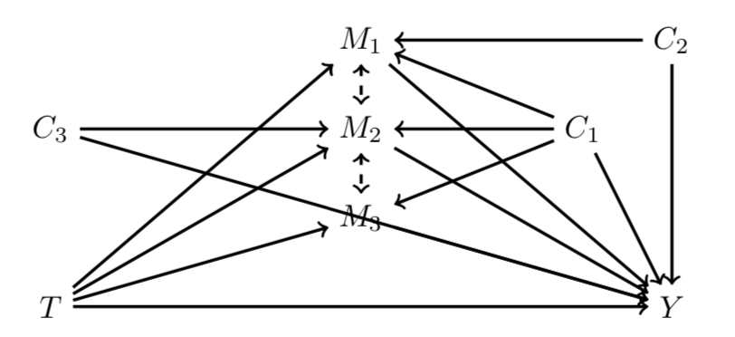
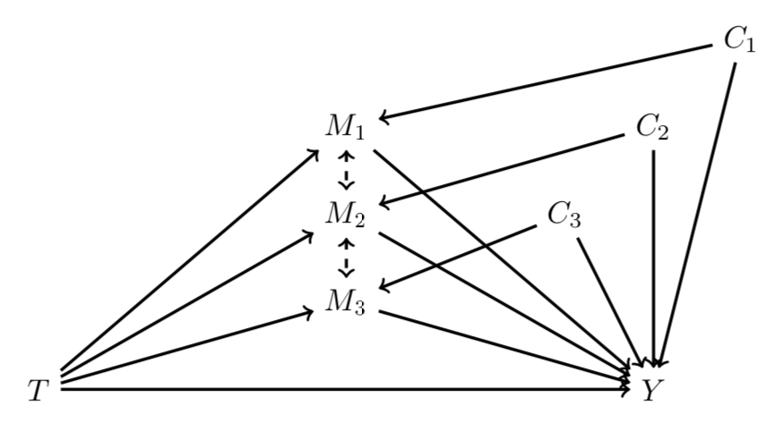
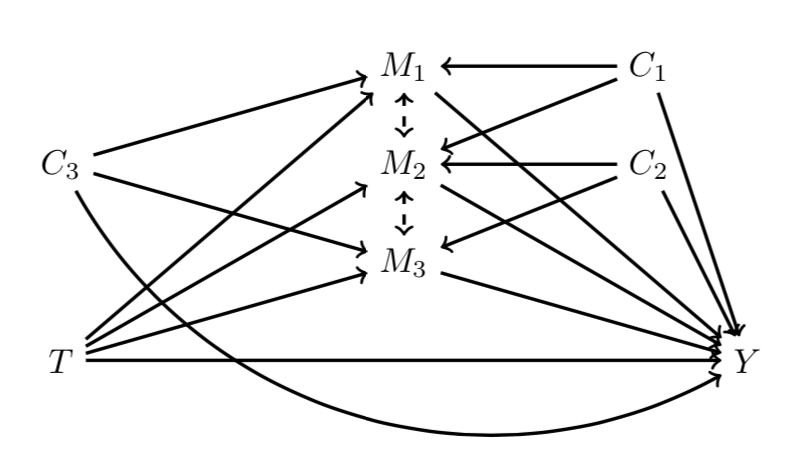
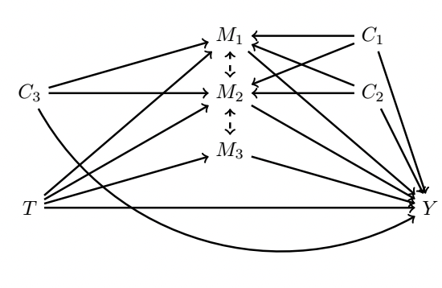

This package is based on the work presented in \cite{jerolon_causal_2018} and the R package mediation presented in \cite{tingley_mediation_2014}. Models supported by our R function are shown in Table \ref{models}.

\begin{center}
\begin{table}[htp]
\begin{tabular}{|l|c|c|c|c|}
\hline
& \multicolumn{4}{c|}{\it{Outcome}}\\\cline{2-5}
\it{Mediators} & Linear & Binary & Ordered categorical & Non-ordered categorical \\
\hline
1) Linear &\checkmark&\checkmark &  \checkmark & \xmark \\
2) Binary (Probit) & \checkmark&\checkmark  &  \checkmark & \xmark\\
3) Ordered categorical (Probit) & \checkmark&\checkmark  &  \checkmark & \xmark \\
4) Non-ordered categorical &  \xmark & \xmark &  \xmark & \xmark\\
Mix of 1), 2) and 3) & \checkmark & \checkmark &  \checkmark & \xmark\\
\hline
\end{tabular}
\caption{Models supported by \texttt{multimediate}.}\label{models}
\end{table}
\end{center}

<table border="4" width="100%">
<thead>
        <tr>
            <th colspan="5">Models supported by multimediate.</th>
        </tr>
    </thead>
  <tr>
    <td>&nbsp;</td>
    <td colspan="5" bgcolor="#333AFF">Outcome</td></tr>
  <tr>
    <td bgcolor="#FF5733">Mediators </td><td bgcolor="#337AFF">Linear</td><td bgcolor="#337AFF">Binary</td><td bgcolor="#337AFF">Ordered categorical</td><td bgcolor="#337AFF">Non-ordered categorical</td></tr>
  <tr>
    <td bgcolor="#FFA533">Linear </td><td>Ok</td><td>Ok</td><td>Ok</td><td>Not yet</td>
  </tr>
  <tr>
    <td bgcolor="#FFA533">Binary (Probit)</td><td>Ok</td><td>Ok</td><td>Ok</td><td>Not yet</td>
  </tr>
  <tr>
    <td bgcolor="#FFA533">Ordered categorical</td><td>Ok</td><td>Ok</td><td>Ok</td><td>Not yet</td>
  </tr>
  <tr>
    <td bgcolor="#FFA533">Non-ordered categorical</td><td>Not yet</td><td>Not yet</td><td>Not yet</td><td>Not yet</td>
  </tr>
</table>


```{r, include = FALSE}
knitr::opts_chunk$set(
  collapse = TRUE,
  comment = "#>"
)
```

```{r setup}
library(multimediate)
```

# Data 1


\begin{figure}[htp]
\centering
\begin{tikzpicture}
% nodes %
\node (M1)	at (3.5,3) 	{$M_1$};
\node (M2)	at (3.5,2) 	{$M_2$};
\node (M3)	at (3.5,1) 	{$M_3$};
\node (C1) 	at (6,2) 	{$C_1$};
\node (C2) 	at (7,3) 	{$C_2$};
\node (C3) 	at (0,2) 	{$C_3$};
\node (T) 		at (0,0) 	{$T$};
\node (Y) 		at (7,0) 	{$Y$};

edges %

\draw [->, line width =1] (M1) --  (Y);
\draw [->, line width =1] (M2) --  (Y);
\draw [->, line width =1] (M3) --  (Y);
\draw [->, line width =1] (T) --  (Y);
\draw [->, line width =1] (T) --  (M1);
\draw [->, line width =1] (T) --  (M2);
\draw [->, line width =1] (T) --  (M3);
\draw [->, line width =1] (C1) --  (Y)  ;
\draw [->, line width =1] (C1) --  (M1);
\draw [->, line width =1] (C1) --  (M2);
\draw [->, line width =1] (C1) --  (M3);
\draw [->, line width =1] (C2) --  (Y);
\draw [->, line width =1] (C2) --  (M1);
\draw [->, line width =1, bend right=45] (C3) -- (Y);
\draw [->, line width =1] (C3) --  (M2);
\draw [<->, dashed, line width =1] (M1) -- (M2);
\draw [<->, dashed, line width =1] (M2) -- (M3);
\end{tikzpicture} 
\caption{DAG of data 1}\label{fig1}
\end{figure}


\begin{center}
\begin{itemize}
\item Binary treatment T
\item Linear Outcome Y
\item Linear mediators $M_1,M_2,M_3$ 
\item Binary covariables $C_1,C_2,C_3$ 
\end{itemize}
\end{center}

```{r DATA1}
data(data1)
data1$Treatment=as.factor(data1$Treatment)
data1$C1=as.factor(data1$C1)
data1$C2=as.factor(data1$C2)
data1$C3=as.factor(data1$C3)
data1$M1=as.numeric(data1$M1)
data1$M2=as.numeric(data1$M2)
data1$M3=as.numeric(data1$M3)
data1$Outcome=as.numeric(data1$Outcome)
summary(data1)
```


```{r REG1}
M1reg=lm(M1~ Treatment + C1 + C2, data=data1)
M2reg=lm(M2~ Treatment + C1 + C3, data=data1)
M3reg=lm(M3~ Treatment + C1     , data=data1)

Yreg=lm(Outcome~ Treatment + M1 + M2 + M3 + C1 + C2 + C3, data=data1)
```

\begin{table}[htp]
\centering
\begin{tabular}{|c|c|c|c|c|c|}
\hline
$\tau$ & $\zeta$ & $\delta^Z$ & $\delta^1$ & $\delta^2$ & $\delta^3$     \\
\hline
 92 & 10 & 82 & 10 & 18 & 54   \\
\hline
\end{tabular}\caption{Values of causal effects in data 1} 
\end{table}

<table>
<thead>
        <tr>
            <th colspan="6">Values of causal effects in data 1.</th>
        </tr>
    </thead>
    <tr>
    <td>Total Effect</td><td>Direct Effect</td><td>Joint Indirect Effect</td><td>Indirect Effect by M1</td><td>Indirect Effect by M2</td><td>Indirect Effect by M3</td>
  </tr>
  <tr>
    <td>92</td><td>10</td><td>82</td><td>10</td><td>18</td><td>54</td>
  </tr>
</table>

```{r MED1}
med.analysis=multimediate(lmodel.m=list(M1reg,M2reg,M3reg),correlated=TRUE,model.y=Yreg,treat="Treatment",treat.value=1,control.value=0,J=1000,conf.level=0.95)

summary(med.analysis,opt="avg")
```

# Data 2 


\begin{figure}[htp]
\centering
\begin{tikzpicture}
% nodes %
\node (M1)	at (3.5,3) 	{$M_1$};
\node (M2)	at (3.5,2) 	{$M_2$};
\node (M3)	at (3.5,1) 	{$M_3$};
\node (C1) 	at (8,4) 	{$C_1$};
\node (C2) 	at (7,3) 	{$C_2$};
\node (C3) 	at (6,2) 	{$C_3$};
\node (T) 		at (0,0) 	{$T$};
\node (Y) 		at (7,0) 	{$Y$};

edges %
\begin{scope}[every path/.style={->, line width= 1}, every node/.style={sloped, inner sep=1pt}]
\draw (M1) --  (Y);
\draw (M2) --  (Y);
\draw (M3) --  (Y);
\draw (T) --  (Y);
\draw (T) --  (M1);
\draw (T) --  (M2);
\draw (T) --  (M3);
\draw (C1) --  (M1);
\draw (C1) --  (Y)  ;
\draw (C2) --  (M2);
\draw (C2) --  (Y);
\draw (C3) --  (M3);
\draw (C3) --  (Y);
\draw [<->, dashed, line width =1] (M1) -- (M2);
\draw [<->, dashed, line width =1] (M2) -- (M3);
\end{scope}
\end{tikzpicture} 
\caption{DAG of data 2}\label{fig2}
\end{figure}

\begin{itemize}
\item Binary treatment T
\item Binary Outcome Y
\item Linear mediators $M_1,M_2,M_3$ 
\item Binary covariables $C_1,C_2,C_3$ 
\end{itemize}

```{r DATA2}
data(data2)
data2$Treatment=as.factor(data2$Treatment)
data2$C1=as.factor(data2$C1)
data2$C2=as.factor(data2$C2)
data2$C3=as.factor(data2$C3)
data2$M1=as.numeric(data2$M1)
data2$M2=as.numeric(data2$M2)
data2$M3=as.numeric(data2$M3)
data2$Outcome=as.factor(data2$Outcome)
summary(data2)
```


```{r REG2}
M1reg=lm(M1~ Treatment + C1, data=data2)
M2reg=lm(M2~ Treatment + C2, data=data2)
M3reg=lm(M3~ Treatment + C3, data=data2)

Yreg=glm(Outcome~ Treatment + M1 + M2 + M3 + C1 + C2 + C3, data=data2, family = binomial("logit"))
```

\begin{table}[htp]
\centering
\begin{tabular}{|c|c|c|c|c|c|}
\hline
$logOR^{\delta^1}$ & $logOR^{\delta^2}$ & $logOR^{\delta^3}$ & $logOR^{\delta^Z}$ & $logOR^{\zeta}$ & $logOR^{\tau}$ \\
\hline
0.195& 0.19 & 0.216  & 0.601  & 0.71 & 1.311 \\
\hline
\end{tabular}\caption{Values of causal effects in data 2} 
\end{table}

<table>
<thead>
        <tr>
            <th colspan="6">Values of causal effects in data 2 on log OR scale.</th>
        </tr>
    </thead>
    <tr>
    <td>Total Effect</td><td>Direct Effect</td><td>Joint Indirect Effect</td><td>Indirect Effect by M1</td><td>Indirect Effect by M2</td><td>Indirect Effect by M3</td>
  </tr>
  <tr>
    <td>1.311</td><td>0.71</td><td>0.601</td><td>0.195</td><td>0.19</td><td>0.216</td>
  </tr>
</table>
```{r MED2}
med.analysis=multimediate(lmodel.m=list(M1reg,M2reg,M3reg),correlated=TRUE,model.y=Yreg,treat="Treatment",treat.value=1,control.value=0,J=1000,conf.level=0.95)

# summary(med.analysis,opt="avg",logit="effects")
# summary(med.analysis,opt="avg",logit="all")
# summary(med.analysis,opt="avg",logit="OR")
summary(med.analysis,opt="avg",logit="logOR")
```

# Data 3


\begin{figure}[htp]
\centering
\begin{tikzpicture}
% nodes %
\node (M1)	at (3.5,3) 	{$M_1$};
\node (M2)	at (3.5,2) 	{$M_2$};
\node (M3)	at (3.5,1) 	{$M_3$};
\node (C1) 	at (6,3) 	{$C_1$};
\node (C2) 	at (6,2) 	{$C_2$};
\node (C3) 	at (0,2) 	{$C_3$};
\node (T) 		at (0,0) 	{$T$};
\node (Y) 		at (7,0) 	{$Y$};

edges %
\begin{scope}[every path/.style={->, line width= 1}, every node/.style={sloped, inner sep=1pt}]
\draw (M1) --  (Y);
\draw (M2) --  (Y);
\draw (M3) --  (Y);
\draw (T) --  (Y);
\draw (T) --  (M1);
\draw (T) --  (M2);
\draw (T) --  (M3);
\draw (C1) --  (Y)  ;
\draw (C1) --  (M1);
\draw (C1) --  (M2);
\draw (C2) --  (Y);
\draw (C2) --  (M2);
\draw (C2) --  (M3);
\draw (C3) to [bend right=45]  (Y);
\draw (C3) --  (M1);
\draw (C3) --  (M3);
\draw [<->, dashed, line width =1] (M1) -- (M2);
\draw [<->, dashed, line width =1] (M2) -- (M3);
\end{scope}
\end{tikzpicture} 
\caption{DAG of data 3}\label{fig3}
\end{figure}


\begin{itemize}
\item Binary treatment T
\item Polytomic Outcome Y
\item Linear mediators $M_1,M_2,M_3$ 
\item Binary covariables $C_1,C_2,C_3$ 
\end{itemize}


```{r DATA3}
data(data3)
data3$Treatment=as.factor(data3$Treatment)
data3$C1=as.factor(data3$C1)
data3$C2=as.factor(data3$C2)
data3$C3=as.factor(data3$C3)
data3$M1=as.numeric(data3$M1)
data3$M2=as.numeric(data3$M2)
data3$M3=as.numeric(data3$M3)
data3$Outcome=as.factor(data3$Outcome)

summary(data3)
```

```{r REG3}
M1reg=lm(M1~ Treatment + C1 + C3, data=data3)
M2reg=lm(M2~ Treatment + C1 + C2, data=data3)
M3reg=lm(M3~ Treatment + C2 + C3, data=data3)

library(MASS)
Yreg=polr(Outcome ~ Treatment + M1 + M2 + M3 + C1 + C2 + C3 , data = data3, method = "probit")

```

\begin{table}
\centering
\begin{tabular}{|c|c|c|c|c|c|}
\hline
$\tau$ & $\zeta$ & $\delta^Z$ & $\delta^1$ & $\delta^2$ & $\delta^3$  \\
\hline
2.21 & 0.5 & 1.71 & 0.32 & 0.44 & 0.60 \\
\hline
\end{tabular}\caption{Values of causal effects in data 3} 
\end{table}

<table>
<thead>
        <tr>
            <th colspan="6">Values of causal effects in data 3.</th>
        </tr>
    </thead>
    <tr>
    <td>Total Effect</td><td>Direct Effect</td><td>Joint Indirect Effect</td><td>Indirect Effect by M1</td><td>Indirect Effect by M2</td><td>Indirect Effect by M3</td>
  </tr>
  <tr>
    <td>2.21</td><td>0.5</td><td>1.71</td><td>0.32</td><td>0.44</td><td>0.60</td>
  </tr>
</table>

```{r MED3}
med.analysis=multimediate(lmodel.m=list(M1reg,M2reg,M3reg),correlated=TRUE,model.y=Yreg,treat="Treatment",treat.value=1,control.value=0,J=100,conf.level=0.95)

summary(med.analysis,opt="avg")
```

# Data 4


\begin{figure}[htp]
\centering
\begin{tikzpicture}
% nodes %
\node (M1)	at (3.5,3) 	{$M_1$};
\node (M2)	at (3.5,2) 	{$M_2$};
\node (M3)	at (3.5,1) 	{$M_3$};
\node (C1) 	at (6,3) 	{$C_1$};
\node (C2) 	at (6,2) 	{$C_2$};
\node (C3) 	at (0,2) 	{$C_3$};
\node (T) 		at (0,0) 	{$T$};
\node (Y) 		at (7,0) 	{$Y$};

edges %
\begin{scope}[every path/.style={->, line width= 1}, every node/.style={sloped, inner sep=1pt}]
\draw (M1) --  (Y);
\draw (M2) --  (Y);
\draw (M3) --  (Y);
\draw (T) --  (Y);
\draw (T) --  (M1);
\draw (T) --  (M2);
\draw (T) --  (M3);
\draw (C1) --  (Y)  ;
\draw (C1) --  (M1);
\draw (C1) --  (M2);
\draw (C2) --  (Y);
\draw (C2) --  (M1);
\draw (C2) --  (M2);
\draw (C2) --  (M3);
\draw (C3) to [bend right=45]  (Y);
\draw (C3) --  (M1);
\draw (C3) --  (M2);
\draw (C3) --  (M3);
\draw [<->, dashed, line width =1] (M1) -- (M2);
\draw [<->, dashed, line width =1] (M2) -- (M3);
\end{scope}
\end{tikzpicture} 
\caption{DAG of data 4}\label{fig4}
\end{figure}


\begin{itemize}
\item Binary treatment T
\item Linear Outcome Y
\item Linear mediator $M_1$
\item Binary mediator $,M_2$
\item Polytomic mediator $M_3$ 
\item Binary covariables $C_1,C_2,C_3$ 
\end{itemize}
```{r DATA4}
data(data4)
data4$Treatment=as.factor(data4$Treatment)
data4$C1=as.factor(data4$C1)
data4$C2=as.factor(data4$C2)
data4$C3=as.factor(data4$C3)
data4$M1=as.numeric(data4$M1)
data4$M3=as.factor(data4$M3)
data4$M2=as.factor(data4$M2)
data4$Outcome=as.numeric(data4$Outcome)
summary(data4)
```

```{r REG4}
M1reg=lm(M1~  Treatment + C1 + C2 + C3, data = data4)
M2reg=glm(M2~ Treatment + C1 + C3, data = data4, family = binomial("probit"))
M3reg=polr(M3~Treatment + C2 + C3     , data = data4, method = "probit")

Yreg=lm(Outcome~ Treatment + M1 + M2 + M3 + C1 + C2 + C3, data=data4)
```

\begin{table}
\centering
\begin{tabular}{|c|c|c|c|c|c|}
\hline
$\tau$ &  $\zeta$ & $\delta^Z$ & $\delta^1$ & $\delta^2$ & $\delta^3$   \\
\hline
60.96 & 10 & 50.96 & 34.2 & 0 & 16.76   \\
\hline
\end{tabular}\caption{Values of causal effects in data 4} 
\end{table}

<table>
<thead>
        <tr>
            <th colspan="6">Values of causal effects in data 4.</th>
        </tr>
    </thead>
    <tr>
    <td>Total Effect</td><td>Direct Effect</td><td>Joint Indirect Effect</td><td>Indirect Effect by M1</td><td>Indirect Effect by M2</td><td>Indirect Effect by M3</td>
  </tr>
  <tr>
    <td>60.96</td><td>10</td><td>50.96</td><td>34.2</td><td>0</td><td>16.76</td>
  </tr>
</table>

```{r MED4}
med.analysis=multimediate(lmodel.m=list(M1reg,M2reg,M3reg),correlated=TRUE,model.y=Yreg,treat="Treatment",treat.value=1,control.value=0,J=1000,conf.level=0.95)

summary(med.analysis,opt="avg")
```

